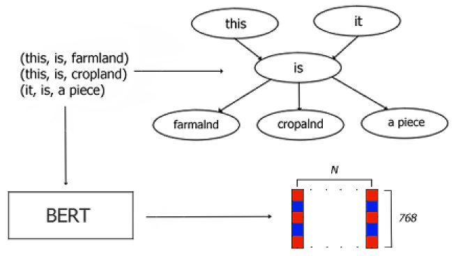

# Remote Sensing image captioning using graph neural networks

## Description
This project was my master's project at the University of Trento. 
The project consists in applying graph neural networks to solve the image captioning task on remote sensing images.


## Installation
To install this project, follow these steps:

1. Clone the repository
   ```bash
   git clone https://github.com/your-username/your-repository.git
2. Install the requirements
   ```bash
   pip install -r requirements.txt
3. Download UCM dataset:
   
   https://figshare.com/articles/dataset/UCM_image_dataset/6085976/2 [1]
5. Prepare the dataset:
   ```bash
   extract_triplets.py
## Usage:
In order to run the training/inference on the models, execute the command below with the desired arguments:
```bash
python run.py
```
In order to prepare the dataset, execute the file `extract_triplets.py` which will produce a json with the triplets extracted from the captions of the dataset. After that, execute `create_graph_data.py` to create the graph data from the triplets.

#### Possible arguments for `run.py`:

<li> <code> --dataset </code>: name of the dataset used for the run (currently "ucm" or "rsicd")</li>
<li> <code> --task </code>: name of the desired task (currently "tripl2caption" or "img2tripl")</li>
<li> <code> --e </code>: number of training epochs</li>
<li> <code> --lr </code>: learning rate</li>
<li> <code> --bs </code>: batch size</li>
<li> <code> --decoder </code>: type of decoder used for GNNs (currently "linear" or "lstm")</li>
<li> <code> --name </code>: name of the file of the network</li>
<li> <code> --es </code>: allow usage of early stopping</li>
<li> <code> --thresh </code>: threshold of early stopping</li>
<li> <code> --test </code>: do the run in test mode (currently implemented only with "tripl2caption")</li>
<li> <code> --o </code>: name of the file with the results of the testing</li>

## General model overview:




## References:
[1] Ali, Nouman; Zafar, Bushra (2018). UCM image dataset. figshare. Dataset. https://doi.org/10.6084/m9.figshare.6085976.v2


