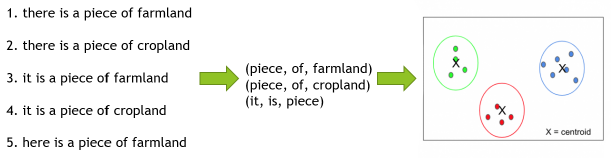
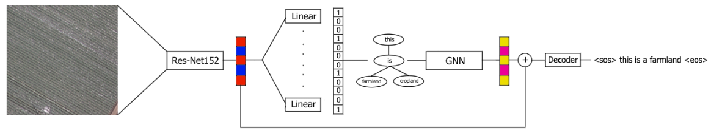
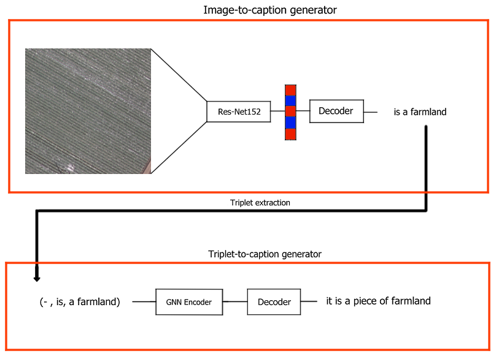

# Remote Sensing image captioning using graph neural networks

## Description
This project was my master's project at the University of Trento. 
The project consists in applying graph neural networks to solve the image captioning task on remote sensing images.


## Installation
To install this project, follow these steps:

1. Clone the repository
   ```bash
   git clone https://github.com/your-username/your-repository.git
2. Install the requirements
   ```bash
   pip install -r requirements.txt
3. Download UCM dataset:
   
   https://figshare.com/articles/dataset/UCM_image_dataset/6085976/2 [1]
5. Prepare the dataset:
   ```bash
   extract_triplets.py
## Usage:
In order to run the training/inference on the models, execute the command below with the desired arguments:
```bash
python run.py
```
In order to prepare the dataset, execute the file `extract_triplets.py` which will produce a json with the triplets extracted from the captions of the dataset. After that, execute `create_graph_data.py` to create the graph data from the triplets.

#### Possible arguments for `run.py`:

<li> <code> --dataset </code>: name of the dataset used for the run (currently "ucm" or "rsicd")</li>
<li> <code> --task </code>: name of the desired task (currently "tripl2caption" or "img2tripl")</li>
<li> <code> --e </code>: number of training epochs</li>
<li> <code> --lr </code>: learning rate</li>
<li> <code> --bs </code>: batch size</li>
<li> <code> --decoder </code>: type of decoder used for GNNs (currently "linear" or "lstm")</li>
<li> <code> --name </code>: name of the file of the network</li>
<li> <code> --es </code>: allow usage of early stopping</li>
<li> <code> --thresh </code>: threshold of early stopping</li>
<li> <code> --test </code>: do the run in test mode (currently implemented only with "tripl2caption")</li>
<li> <code> --o </code>: name of the file with the results of the testing</li>

## Data Preprocessing overview:

The data for image cationing are composed by images and the corresponding sentences as labels. To make use of GNNs, I converted the sentences to lists of triplets composed by [subject, verb, object] and clustered all the triplets in the dataset in order to reduce redundancy.



Once the triplets are obtained, the graph is created by connecting the nodes which have a relation to create a scene graph of the sentence. Once the graph is created, the features of the graphs are created by giving in input the triplets to a pre-trained BERT [2] model as shown in the picture below:


## Model options

We used mainly two pipelines for this work: the end-to-end pipeline and the "waterfall" pipeline.

End-to-End:



Waterfall:



All the pipelines above use pre-trained ResNet [3] to extract features from the images. In addition to ResNet, the pipelines can use multiple GNN and Decoder structure. Here there is a list of implemented structures of this code:

### GNN

1. Graph attention network [4]
2. Multi-layer attention network [5]

### Decoders

1. Multi-head linear decoder
2. LSTM decoder [6]

## References:
[1] Ali, Nouman; Zafar, Bushra (2018). UCM image dataset. figshare. Dataset. https://doi.org/10.6084/m9.figshare.6085976.v2

[2] BERT: Pre-training of Deep Bidirectional Transformers for Language Understanding (Devlin et al., NAACL 2019) [10.18653/v1/N19-1423](https://aclanthology.org/N19-1423/)

[3] K. He, X. Zhang, S. Ren and J. Sun, "Deep Residual Learning for Image Recognition," 2016 IEEE Conference on Computer Vision and Pattern Recognition (CVPR), Las Vegas, NV, USA, 2016, pp. 770-778, doi: 10.1109/CVPR.2016.90.

[4] Veličković, P., Cucurull, G., Casanova, A., Romero, A., Lio, P., & Bengio, Y. (2017). Graph attention networks. arXiv preprint arXiv:1710.10903.

[5] Itoh, T. D., Kubo, T., & Ikeda, K. (2022). Compositionality-Aware Graph2Seq Learning. arXiv preprint arXiv:2201.12178.

[6] Hochreiter, Sepp & Schmidhuber, Jürgen. (1997). Long Short-term Memory. Neural computation. 9. 1735-80. 10.1162/neco.1997.9.8.1735.


